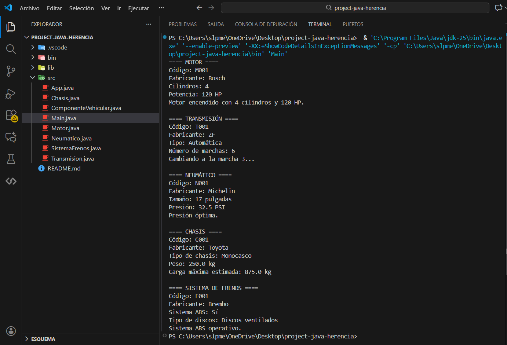

# project-java-herencia

## Descripcion de la Jerarquia de Clases

Este proyecto implementa los conceptos de herencia y polimorfismo en Java mediante la creacion de una jerarquia de clases para componentes vehiculares.

**Clase Base:**
* ComponenteVehicular: Define atributos comunes (codigo, fabricante) y el metodo "mostrarInformacion" que es sobrescrito por las subclases.

**Clases Derivadas (Subclases):**
* Motor: Hereda de ComponenteVehicular y añade cilindros y potencia, ademas del metodo particular "encenderMotor".
* Transmision: Hereda y añade tipo y marchas, con el metodo particular "cambiarMarcha(int)".
* Neumatico: Hereda y añade tamaño y presion, con el metodo particular "verificarPresion".
* Chasis: Hereda y añade tipo y peso, con el metodo particular "calcularCargaMaxima".
* SistemaFrenos: Hereda y añade tieneABS y tipoDiscos, con el metodo particular "verificarABS".

## Captura de Ejecucion

